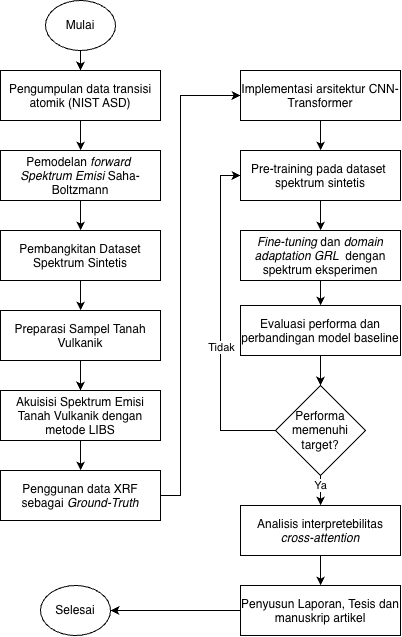
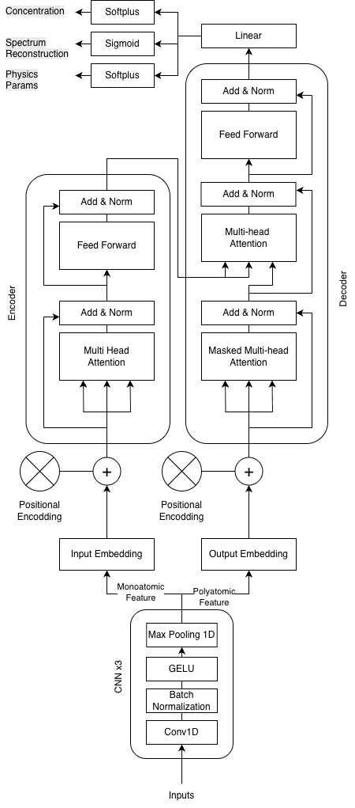
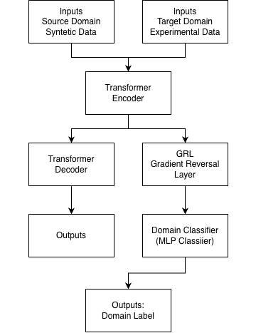

# Isian Substansial Proposal (Skema Penelitian Tesis Magister — PTM)

*(Silakan salin dan tempel bagian-bagian di bawah ini ke dalam dokumen Word PTM Anda sesuai urutan)*

---

## Nama Ketua: Nasrullah Idris | NIDN: 0003077609

---

## JUDUL

CNN–Transformer Encoder–Decoder untuk Analisis Kuantitatif LIBS: Dekomposisi Spektral Mono–Poliatomik Eksplisit pada Karakterisasi Tanah Vulkanik

---

## RINGKASAN

Laser-Induced Breakdown Spectroscopy (LIBS) merupakan teknik spektroskopi emisi yang memungkinkan analisis multi-elemen secara cepat tanpa memerlukan preparasi sampel yang kompleks. Meskipun pendekatan Calibration-Free LIBS (CF-LIBS) memungkinkan kuantifikasi unsur tanpa standar rujukan eksternal, akurasinya sangat sensitif terhadap penyimpangan asumsi Local Thermodynamic Equilibrium (LTE), terutama efek matriks berupa penyerapan mandiri (self-absorption) dan gradien spasial plasma saat diaplikasikan pada material heterogen seperti tanah vulkanik. Di sisi lain, pendekatan machine learning yang ada memperlakukan spektrum LIBS sebagai single composite signal, mengabaikan fakta fisik fundamental bahwa spektrum poliatomik sejatinya merupakan superposisi terbobot konsentrasi dari spektrum monoatomik penyusunnya. Belum ada riset yang secara eksplisit memodelkan dekomposisi mono→poliatomik dalam kerangka pembelajaran.

Penelitian ini mengusulkan arsitektur CNN–Transformer Encoder–Decoder yang secara struktural memodelkan hubungan dekomposisi spektral. Encoder memproses spektrum monoatomik individual yang dibangkitkan oleh Saha–Boltzmann forward model untuk mempelajari representasi laten per-elemen melalui self-attention. Decoder menerima spektrum campuran poliatomik dan memprediksi konsentrasi elemen melalui mekanisme cross-attention terhadap output encoder, sehingga mempelajari aturan komposisi spektral secara end-to-end. Lapisan 1D-CNN mengekstraksi fitur profil emisi lokal sebelum Transformer menangkap dependensi panjang gelombang global.

Model akan di-pre-train pada spektrum sintetis yang dibangkitkan dari transisi NIST Atomic Spectra Database dan di-fine-tune pada pengukuran LIBS eksperimental pada sampel tanah vulkanik dari Aceh, Indonesia, dengan data X-ray Fluorescence (XRF) sebagai ground-truth konsentrasi. Perbandingan baseline dilakukan terhadap model CNN-only, Transformer-only, Partial Least Squares, dan Informer. Kontribusi penelitian ini meliputi: (i) framework encoder–decoder yang memisahkan representasi spektral mono/poliatomik secara struktural, (ii) mekanisme cross-attention untuk regresi konsentrasi yang physically interpretable, dan (iii) aplikasi pada matriks tanah vulkanik kompleks Aceh, Indonesia.

---

## KATA KUNCI

LIBS; deep learning; CNN–Transformer; encoder–decoder; cross-attention; dekomposisi spektral; tanah vulkanik

---

## PENDAHULUAN

### Latar Belakang

Laser-Induced Breakdown Spectroscopy (LIBS) merupakan teknik spektroskopi emisi yang telah banyak digunakan untuk analisis komposisi unsur pada berbagai material kompleks, termasuk mineral, batuan, dan material tanah (Legnaioli et al., 2025). Kemampuan LIBS untuk melakukan analisis multi-elemen secara cepat tanpa memerlukan preparasi sampel yang kompleks menjadikannya metode yang menarik untuk aplikasi geokimia dan eksplorasi sumber daya alam (Sawyers et al., 2025). Berbagai penelitian menunjukkan bahwa LIBS telah berhasil digunakan untuk kuantifikasi unsur pada sampel geologi melalui beragam pendekatan analitik, mulai dari regresi multivariat, kurva kalibrasi univariat berbasis garis spektral tertentu (Zhang et al., 2025), hingga metode berbasis machine learning (Babos et al., 2024; Manzoor et al., 2025). Pendekatan-pendekatan tersebut mampu mencapai akurasi analitik yang tinggi, namun keberhasilan kuantifikasi sangat bergantung pada strategi pemodelan spektrum serta sensitivitas metode terhadap efek matriks pada sampel geologi yang kompleks (Hao et al., 2024; Manelski et al., 2024). Kondisi ini menjadi semakin relevan pada analisis tanah vulkanik, yang secara inheren memiliki komposisi multi-elemen dengan variasi matriks yang tinggi.

Dalam pendekatan kuantitatif LIBS, salah satu metode yang banyak digunakan adalah Calibration-Free LIBS (CF-LIBS), yang memungkinkan estimasi komposisi unsur tanpa memerlukan sampel standar kalibrasi. Metode ini bergantung pada ekstraksi parameter plasma fundamental seperti temperatur elektron (T_e) dan densitas elektron (n_e), yang dihitung berdasarkan asumsi Local Thermodynamic Equilibrium (LTE) (Cristoforetti et al., 2010). Namun, asumsi plasma homogen dalam kondisi LTE sering kali tidak memadai untuk mendeskripsikan plasma LIBS yang bersifat sangat transien dan bergradien tinggi (Zaitsev et al., 2024; Bultel et al., 2025). Penyimpangan dari kondisi LTE ini dapat memicu distorsi spektral akibat efek opasitas optik dan penyerapan mandiri (self-absorption), yang pada akhirnya mengganggu stabilitas estimasi temperatur dan densitas plasma (Tang et al., 2024; Hansen et al., 2021). Pendekatan berbasis model fisika plasma seperti model radiative transfer adaptif MERLIN (Favre et al., 2025) yang memanfaatkan distribusi Saha–Boltzmann serta Persamaan Transfer Radiatif menunjukkan bahwa rekonstruksi spektrum LIBS yang kompleks dapat dicapai dengan mempertahankan konsistensi termodinamika plasma, meskipun implementasinya masih menghadapi hambatan komputasi yang signifikan akibat kebutuhan inversi numerik nonlinier (Favre et al., 2025b).

Perkembangan metode machine learning dan deep learning telah menawarkan alternatif untuk mempercepat analisis spektrum LIBS dengan mempelajari hubungan nonlinier antara spektrum dan parameter plasma secara langsung dari data. Convolutional Neural Networks (CNN) mampu menangkap fitur lokal seperti profil garis emisi, sementara arsitektur Transformer memodelkan dependensi jarak jauh sepanjang sumbu panjang gelombang (Liu et al., 2026). Model hibrida CNN–Transformer telah menunjukkan hasil menjanjikan untuk kuantifikasi unsur jejak pada baja (Liu et al., 2026) dan untuk klasifikasi signatur spektral pada sampel multi-elemen (Walidain et al., 2026). Namun, sebagian besar model data-driven beroperasi sebagai black box yang tidak secara eksplisit mempertimbangkan hukum fisika plasma yang mendasari pembentukan spektrum emisi (Hao et al., 2024). Fakta fisik fundamental yang belum dieksploitasi adalah: spektrum LIBS poliatomik merupakan superposisi terbobot konsentrasi dari spektrum monoatomik penyusunnya. Seluruh model eksisting—baik berbasis fisika maupun data-driven—memperlakukan spektrum sebagai single signal dan mengabaikan struktur komposisional ini. **Belum ada penelitian sebelumnya yang secara eksplisit memodelkan dekomposisi spektrum campuran ke dalam konstituennya dalam kerangka pembelajaran.** Cross-attention, mekanisme yang awalnya diusulkan untuk translasi sekuens-ke-sekuens (Vaswani et al., 2017), sangat ideal untuk tugas ini: decoder dapat meng-query representasi elemen dari encoder untuk mengetahui kontribusi monoatomik mana yang membentuk observasi poliatomik tertentu (Liu et al., 2026; Walidain et al., 2026).

**Penelitian ini mengusulkan arsitektur CNN–Transformer encoder–decoder yang memperkenalkan dekomposisi spektral mono–poliatomik eksplisit ke dalam analisis kuantitatif LIBS.** Encoder memproses spektrum monoatomik individual yang dibangkitkan oleh Saha–Boltzmann forward model untuk mempelajari representasi laten spesifik-elemen. Decoder menerima spektrum campuran poliatomik dan memprediksi konsentrasi elemen melalui cross-attention terhadap output encoder. Lapisan 1D-CNN mengekstraksi fitur emisi lokal sebelum Transformer menangkap dependensi panjang gelombang global. Model di-pre-train pada spektrum sintetis dari NIST Atomic Spectra Database dan di-fine-tune pada pengukuran LIBS eksperimental tanah vulkanik dari Aceh, Indonesia, dengan analisis XRF menyediakan ground-truth konsentrasi.

### Rumusan Masalah

1. Bagaimana memodelkan hubungan antara spektrum poliatomik yang dihasilkan dari plasma LIBS dengan spektrum monoatomik penyusun yang merepresentasikan karakteristik unsur individual?
2. Bagaimana merancang arsitektur pembelajaran mendalam yang mampu mengekstraksi fitur spektral lokal serta menangkap dependensi global antar panjang gelombang pada spektrum LIBS?
3. Bagaimana memanfaatkan arsitektur CNN–Transformer encoder–decoder untuk mempelajari hubungan struktural antara spektrum monoatomik dan spektrum poliatomik dalam analisis spektrum LIBS?
4. Bagaimana kinerja model yang diusulkan dalam memprediksi konsentrasi unsur serta parameter plasma dari spektrum LIBS pada sampel tanah vulkanik?

### Tujuan Khusus

1. Memodelkan komposisi spektral melalui arsitektur encoder–decoder yang secara eksplisit memodelkan hubungan antara spektrum monoatomik (representasi per-elemen) dan spektrum poliatomik (campuran terukur).
2. Mengembangkan arsitektur hibrida CNN–Transformer yang menggabungkan ekstraksi fitur lokal (CNN 1D untuk profil puncak emisi) dan pemodelan dependensi global (Transformer untuk korelasi antar panjang gelombang) dalam paradigma encoder–decoder.
3. Memprediksi konsentrasi unsur secara akurat pada sampel tanah vulkanik dari Aceh dan mengevaluasi kinerja model terhadap baseline (PLS, CNN-only, Transformer-only, Informer).

### Kebaruan (Novelty)

1. **Pemodelan spektral mono–poliatomik**: Pendekatan pertama yang secara eksplisit memodelkan hubungan komposisi antara spektrum monoatom dan poliatom LIBS melalui mekanisme cross-attention.
2. **Kerangka CNN–Transformer untuk analisis LIBS**: Arsitektur hibrida yang menggabungkan ekstraksi fitur lokal (CNN) dan pemodelan dependensi global (Transformer) dalam paradigma encoder–decoder.
3. **Karakterisasi tanah vulkanik**: Prediksi kuantitatif konsentrasi unsur pada matriks geologi kompleks, relevan untuk vulkanologi dan penilaian tanah pertanian.

---

## PENELITIAN TERDAHULU

### A. Fondasi Riset Grup — LIBS pada Material Geologi Aceh & Indonesia

Penelitian analisis geokimia material geologi dari wilayah Aceh dan Indonesia menggunakan teknik LIBS telah menjadi fokus utama grup riset. Mitaphonna et al. (2023) melakukan identifikasi deposit tsunami 2004 di Desa Pulot, Kabupaten Aceh Besar menggunakan analisis geokimia, membuktikan kemampuan teknik spektroskopi dalam mengkarakterisasi signatur geokimia tanah terdampak bencana alam. Dalam kelanjutannya, Mitaphonna et al. (2024) menerapkan teknik LIBS secara langsung untuk analisis geokimia kualitatif deposit tsunami di Seungko Mulat, Aceh Besar, berhasil mengidentifikasi keberadaan elemen-elemen mayor seperti Si, Al, Fe, Ca, Mg, Na, dan K pada sampel tanah. Studi ini menunjukkan bahwa LIBS mampu mendeteksi elemen-elemen target yang relevan, namun analisis yang dilakukan **masih bersifat kualitatif** — menjustifikasi kebutuhan pendekatan kuantitatif yang lebih akurat.

Pada skala nasional, Khumaeni, Idris et al. (2025) mendemonstrasikan penerapan CF-LIBS untuk analisis komposisi geokimia dan mineral tanah vulkanik yang terdampak erupsi Gunung Merapi di Jawa Tengah. Studi ini membuktikan bahwa CF-LIBS **dapat** diterapkan pada tanah vulkanik Indonesia, namun sekaligus mengekspos keterbatasan inherennya: akurasi bergantung pada validitas asumsi LTE yang sering dilanggar pada matriks tanah vulkanik yang sangat heterogen. Keterbatasan ini menjadi motivasi langsung untuk pengembangan pendekatan berbasis deep learning yang diusulkan dalam tesis ini.

### B. Lanskap Riset LIBS + Artificial Intelligence

Perkembangan penelitian LIBS telah berevolusi dari simulasi fisika murni menuju integrasi machine learning dan deep learning:

**Favre et al. (2025)** mengembangkan pendekatan ML CF-LIBS kuantitatif yang memanfaatkan ekstraksi fitur CNN dari database simulasi berskala besar. Pendekatan ini terbukti ampuh untuk diagnostik simultan tanpa rekalibrasi, namun performa baseline-nya **kolaps pada percampuran puncak dense overlap** yang umum dijumpai pada spektrum tanah vulkanik. Hal ini menunjukkan kebutuhan akan mekanisme kompensasi yang lebih canggih.

**Wang et al. (2024)** mengusulkan hibridisasi pra-filter wavelet dengan arsitektur Transformer dan CNN untuk analisis spectral berbantuan simulasi. Pendekatan ini mantap memadukan ikatan global dependency dan deteksi pendaran lokal, namun **celah overlap fisik garis emisi tetap diabaikan** dan diperlakukan sebagai single signal statis.

**Liu et al. (2026)** memperkenalkan hibridisasi CNN–Transformer untuk LIBS jarak jauh (remote LIBS) pada analisis unsur baja. Arsitektur ini berhasil menggabungkan deteksi pola lokal (CNN) dan dependensi global (Transformer), namun spektrum tetap diperlakukan sebagai **single composite signal** tanpa mempertimbangkan struktur komposisi spektral mono–poliatomik.

**Walidain et al. (2026)** mengadaptasi arsitektur Informer (ProbSparse attention) untuk klasifikasi spektral LIBS pada sampel geologi. Studi ini membuktikan bahwa mekanisme attention yang efisien mampu memproses spektrum LIBS bersekuens ultra-panjang, namun **hanya mencapai klasifikasi kualitatif**, bukan regresi kuantitatif konsentrasi.

### Kesimpulan Research Gap

**Observasi kunci**: Semua pendekatan di atas memperlakukan spektrum sebagai single signal. Struktur komposisi spektrum LIBS — yaitu bahwa spektrum poliatomik merupakan superposisi dari spektrum monoatomik penyusun — belum pernah dieksplorasi secara eksplisit. Tidak ada penelitian sebelumnya yang: (i) memisahkan spektrum monoatom vs poliatom, (ii) menggunakan mekanisme attention lintas komposisi, maupun (iii) menerapkan kerangka encoder–decoder untuk LIBS. Oleh karena itu, penelitian ini mengusulkan pendekatan di mana encoder mempelajari representasi monoatom, decoder merekonstruksi komposisi poliatom via cross-attention, dan prediksi konsentrasi unsur dilakukan secara end-to-end.

---

## PETA JALAN (ROADMAP) PENELITIAN

*(Sisipkan gambar diagram Peta Jalan di bawah ini)*

**Gambar 1.** Peta jalan penelitian menunjukkan progresi dari fondasi riset grup (analisis geokimia LIBS di Aceh & tanah vulkanik Indonesia) menuju riset AI spektral LIBS mutakhir, hingga kontribusi tesis ini berupa dekomposisi mono–poliatomik eksplisit via CNN–Transformer Encoder–Decoder.

---

## PROFIL MAHASISWA MAGISTER

| Item | Detail |
|------|--------|
| Nama Mahasiswa | Birrul Walidain |
| NIM | 250820201100015 |
| Program Studi | Magister Fisika, FMIPA Universitas Syiah Kuala |
| Judul Proposal | CNN–Transformer Encoder–Decoder untuk Analisis Kuantitatif LIBS: Dekomposisi Spektral Mono–Poliatomik Eksplisit pada Karakterisasi Tanah Vulkanik |

**Perkembangan Tesis:**
Mahasiswa telah menyelesaikan desain arsitektur CNN–Transformer encoder–decoder dan implementasi modul pembangkitan data sintetis berbasis forward model Saha–Boltzmann dengan data transisi dari NIST Atomic Spectra Database. Tahap saat ini meliputi pre-training model pada dataset sintetis (10.000 spektrum, 7 elemen mayor) dan preparasi sampel tanah vulkanik dari lereng Gunung Seulawah Agam, Aceh. Sebuah manuskrip jurnal sedang disusun untuk publikasi di IOP Machine Learning: Science and Technology. Studi pendahulu berupa klasifikasi spektral LIBS menggunakan arsitektur Informer telah dipublikasikan (Walidain et al., 2026).

---

## METODE PENELITIAN

### Tempat dan Waktu Penelitian

Penelitian ini dilaksanakan dalam dua tahap utama yang mencakup kegiatan eksperimental dan komputasional. Tahap eksperimental meliputi preparasi sampel yang dilakukan di **Laboratorium Material, FMIPA Universitas Syiah Kuala**, serta akuisisi data spektrum LIBS yang dilaksanakan di **Laboratorium Optika dan Aplikasi Laser, FMIPA Universitas Syiah Kuala**. Laboratorium ini dilengkapi dengan sistem LIBS berbasis laser Nd:YAG dan spektrometer Echelle yang telah digunakan dalam berbagai studi spektroskopi sebelumnya (Mitaphonna et al., 2023; Mitaphonna et al., 2024; Khumaeni et al., 2025). Pengukuran komposisi unsur sebagai data referensi (*ground-truth*) menggunakan instrumen X-Ray Fluorescence (XRF) dilakukan di fasilitas analisis yang tersedia di lingkungan Universitas Syiah Kuala.

Tahap komputasional — yang mencakup pembangkitan data sintetis, pengembangan arsitektur model CNN–Transformer encoder–decoder, serta seluruh siklus pelatihan dan evaluasi — dilaksanakan menggunakan **GPU Compute Server** yang tersedia di laboratorium penelitian. Keseluruhan penelitian direncanakan berlangsung selama **10 bulan**, dari Februari 2025 hingga November 2025, dengan rincian per fase disajikan pada bagian Jadwal Penelitian.

### Alat dan Bahan Penelitian

Penelitian ini memadukan pendekatan fisika eksperimental optik dan komputasi *machine learning*. Oleh karena itu, instrumen yang digunakan dikategorikan menjadi instrumen perangkat keras eksperimental, infrastruktur komputasi, perangkat lunak penunjang, serta sumber data.

#### Instrumen Eksperimental dan Preparasi Sampel

Peralatan eksperimen utama yang digunakan untuk pengadaan sampel tanah vulkanik dan penembakan spektral LIBS disajikan pada Tabel berikut:

| No | Alat/Bahan | Spesifikasi | Jumlah |
|----|-----------|-------------|--------|
| 1 | Laser Nd:YAG | Q-switched, λ = 1064 nm, 114 mJ | 1 unit |
| 2 | Lensa bikonveks | f = 155 mm (pemfokusan laser) | 1 unit |
| 3 | Spektrometer Echelle + detektor OMA | Rentang spektral 200–900 nm | 1 unit |
| 4 | Mesin *Hydraulic Press* | Tekanan hingga 7 ton | 1 unit |
| 5 | Mortar, Pestel, dan Ayakan | Penggerusan dan ayakan 40 mesh (420 µm) | 1 set |
| 6 | Instrumen XRF | Ground-truth kuantifikasi elemen | 1 unit |
| 7 | Sampel tanah vulkanik | G. Seulawah Agam (4 arah × 3 kedalaman) | **24 sampel** |

#### Perangkat Keras Komputasi

Untuk mengakomodasi kalkulasi dari pembuatan arsitektur *deep learning* (CNN–Transformer) dan *forward modeling* data sintetis, penelitian ini memerlukan kapabilitas komputasi berkinerja tinggi yang disokong oleh:

1. **Laptop Apple MacBook Air M1 2020**: Dilengkapi dengan prosesor *Apple M1*, memori (RAM) sebesar 8 GB, dan penyimpanan *SSD*. Perangkat ini secara utama digunakan untuk pengembangan skrip kode lokal, eksplorasi matematis awal, dan penyusunan laporan akademis.
2. **Infrastruktur *High Performance Computing* (HPC) Mahameru 4 BRIN**: Infrastruktur ini digunakan secara masif untuk simulasi spektroskopi emisi sintetis berskala besar dan pelatihan model CNN--Transformer yang intensif secara komputasi. Spesifikasi komputasinya meliputi:
   - **Klaster CPU**: 92 *compute node* dengan dual prosesor Xeon Gold (sekitar 32 core per *node*) dan 256 GB RAM per *node*. Terdapat 1 *high memory node* dengan kapasitas memori hingga 1.5 TB.
   - **Klaster GPU**: Terkonsolidasi dari berbagai akselerator *Graphics Processing Unit* kelas berat (di antaranya varian NVIDIA DGX A100, V100, dan P100).
   - **Sistem Penyimpanan**: Kapasitas masif total 4.5 PB, didukung arsitektur *High Performance SSD* untuk menampung matriks HDF5 berjuta-baris dengan efisien.
   - **Jaringan Interkoneksi**: *InfiniBand HDR* (dengan laju transfer 100 Gbps antar sistem server).
   - **Sistem Penjadwalan *Job***: Dikelola melalui antrian basis SLURM (*Simple Linux Utility for Resource Management*).

#### Perangkat Lunak

Siklus komputasional dan eksekusi jaringan model difasilitasi melalui perangkat lunak berikut:

1. **Sistem Operasi & Lingkungan**: *macOS Ventura 13.6* pada perangkat lokal, dan mesin berbasis *Ubuntu* Linux pada arsitektur server *High Performance Computing*.
2. **Bahasa Pemrograman**: *Python 3.10* ditetapkan sebagai ekosistem operasional primer yang disokong oleh antarmuka *Jupyter Notebook* interaktif untuk validasi prototipe.
3. **Pustaka Algoritma *Deep Learning***: ***PyTorch*** dipilih secara esensial sebagai kerangka kerja tulang punggung arsitektur neural (sub-rutin *Convolution* dan *Cross-Attention*). Digabungkan spesifik dengan modul ***TensorBoard*** untuk pemantauan kurva iteratif metrik regresi per-*epoch* (Paszke et al., 2019).
4. **Pustaka Sains Data (*Data Science*)**: *NumPy* dan *Pandas* dimanfaatkan khusus merekayasa kompilasi baris numerik dimensi tinggi; modul *h5py* murni sebagai pengelola *file* ekspor set data spektral HDF5; *scikit-learn* mengeksekusi rotasi grup *5-fold cross validation* & skor akurasi; serta *Matplotlib* / *Seaborn* yang memperindah render visual. Modul standar Python *itertools* juga dilibatkan dalam iterasi logik kompleks.

#### Sumber Data Spektroskopik

1. **NIST Atomic Spectra Database (ASD)**: Merupakan basis kompilasi standar yang diakses langsung pada server *National Institute of Standards and Technology* (Kramida et al., 2024). Ekstraksi dari tabel spektra ini menyuplai pondasi variabel kuantum seperti batas energi ionisasi ($E_{\infty,i}$), eksitasi energi status ($E_k, E_i$), degenerasi probabilitas ($g_k, g_i$), hingga peluruhan transisi foton ($A_{ki}$) yang menentukan keberhasilan dari algoritma fisika plasma termodinamika buatan kita.

### Diagram Alir Penelitian

Secara komprehensif, kerangka kerja eksperimental dan komputasional dalam penelitian ini divisualisasikan melalui diagram alir pada Gambar 1.

**Gambar 1. Diagram Alir Penelitian**

### Prosedur Penelitian

Prosedur pelaksanaan penelitian ini terdiri dari 4 (empat) tahapan utama yang mendukung rancangan pada diagram alir di atas. Secara garis besar, penelitian mengikuti alur kerja yang mengintegrasikan pendekatan fisika eksperimental optik dan teknik *deep learning*:

1. **Tahap Offline** — Pembangkitan dataset sintetis menggunakan *forward model* Saha–Boltzmann berdasarkan data transisi atomik NIST, yang digunakan untuk *pre-training* model.
2. **Tahap Online** — Akuisisi data eksperimental LIBS dari sampel tanah vulkanik, diikuti dengan *fine-tuning* dan evaluasi model pada data riil.

Kombinasi tahapan ini dirancang untuk mengatasi keterbatasan jumlah data eksperimental yang tersedia (24 sampel) dengan cara memanfaatkan pengetahuan fisika plasma terlebih dahulu melalui data sintetis (Wang et al., 2024; Favre et al., 2025b), kemudian mentransfer representasi yang telah dipelajari ke domain eksperimental.

#### Tahap 1: Pembangkitan Data Sintetis

Keterbatasan utama dalam pengembangan model *deep learning* untuk analisis LIBS adalah minimnya ketersediaan data eksperimental berlabel yang memadai untuk pelatihan. Untuk mengatasi hal ini, penelitian ini memanfaatkan *forward model* berbasis fisika plasma untuk membangkitkan dataset sintetis berskala besar. Pendekatan ini telah terbukti efektif dalam meningkatkan kemampuan generalisasi model melalui *pre-training* pada data sintetis sebelum *fine-tuning* pada data eksperimental (Wang et al., 2024; Favre et al., 2025b).

Sebelum algoritma numerik dieksekusi, parameter input yang mencakup rentang konsentrasi (*ground-truth* sintetis) dan karakteristik instrumen fisis didefinisikan secara konstan terlebih dahulu. Rentang referensi kelompok elemen penyusun matriks disajikan secara komprehensif pada **Tabel Rentang Referensi Komposisi Elemen**. Sementara batas variabel simulasi hukum fisikanya dipaparkan secara eksplisit di awal melalui **Tabel Parameter Fisis dan Instrumental**.

**Tabel Rentang Referensi Komposisi Elemen Tanah Vulkanik**

| Grup | Elemen | Rentang Komposisi (%) | Peran / Catatan |
|------|--------|-----------------------|-----------------|
| **Mayor** | Si | 40 – 60 | Komponen silikat dominan |
| **Mayor** | Al | 10 – 18 | Mineral aluminosilikat / feldspar |
| **Mayor** | Fe | 5 – 15 | Oksida besi dan mineral feromagnesia |
| **Mayor** | Ca | 3 – 10 | Plagioklas dan mineral karbonat |
| **Mayor** | Mg | 2 – 8 | Mineral olivin dan piroksen |
| **Mayor** | Na | 1 – 5 | Komponen feldspar alkali |
| **Mayor** | K | 1 – 5 | Feldspar kalium |
| **Mayor** | Ti | 0.5 – 2 | Mineral oksida (ilmenit / rutil) |
| **Jejak** | Mn | 0.05 – 0.5 | Berasosiasi dengan mineral Fe |
| **Jejak** | P | 0.05 – 0.5 | Mineral apatit |
| **Jejak** | Ba | 0.01 – 0.3 | Elemen jejak asosiasi alkali |
| **Jejak** | Sr | 0.01 – 0.2 | Mensubstitusi Ca dalam feldspar |
| **Jejak** | Zn | 0.005 – 0.1 | Elemen jejak sulfida / oksida |
| **Jejak** | Cu | 0.001 – 0.05 | Logam jejak sulfida |
| **Jejak** | Ni | 0.001 – 0.05 | Asosiasi mineral mafik |
| **Jejak** | Cr | 0.001 – 0.05 | Indikator mineral ultramafik |
| **Jejak** | V | 0.001 – 0.05 | Logam transisi pada mineral mafik |
| **Jejak** | Rb | 0.001 – 0.05 | Elemen alkali dalam feldspar |
| **Jejak** | Pb | 0.001 – 0.02 | Logam jejak berat |
| **Jejak** | Co | 0.001 – 0.02 | Berasosiasi dengan mineral Fe |
| **Jejak** | Mo | 0.0005 – 0.01 | Logam jejak minor |
| **Jejak** | Y | 0.0005 – 0.01 | Berasosiasi dengan *rare earth element* (REE) |
| **Jejak** | Zr | 0.001 – 0.02 | Mineral penyerta zirkon |
**Tabel Parameter Fisis dan Instrumental Simulasi Data Sintetis**

| Kategori / Parameter | Nilai / Rentang | Keterangan |
|---|---|---|
| Rentang Suhu Elektron ($T_e$) | 6.000 – 15.000 K | Memodelkan fluktuasi pendinginan plasma |
| Rentang Densitas Elektron ($n_e$) | $10^{16}$ – $10^{17}$ $\text{cm}^{-3}$ | Memenuhi kriteria McWhirter untuk LTE |
| Rentang Spektral ($\lambda$) | 200 – 900 nm | Kesesuaian rentang Echelle spectrometer |
| Resolusi Sistem (FWHM) | 0.02 nm | Resolusi optik instrumental |
| Profil Bentuk Garis Emisi | Kurva Voigt | Transisi termal pelebaran Doppler & Stark |
| Fungsi Pelebaran Optik | Gaussian | Karakterisasi difraksi grating |
| Total Data | 10.000 pasang | Varians komprehensif untuk *Deep Learning* |

Setelah pondasi input di atas dipastikan secara ketat, tahapan operasional eksekusi logika pembangkitan data otomatis dikonstruksi secara programatik meliputi langkah berikut:

1. **Pengumpulan data transisi atomik** diunduh secara algoritmik dari *database* referensi (Kramida et al., 2024). Parameter konstan panjang gelombang ($\lambda_{ki}$), Einstein ($A_{ki}$), dan termal nukleus ($E_i$, $g_i$) diseleksi khusus menurut Tabel Rentang Referensi Komposisi Elemen.
2. **Penghitungan populasi analit** bersandar penuh pada kesetimbangan termodinamika lokal (*Local Thermodynamic Equilibrium* / LTE). Fraksi atom netral dan fraksi ion direkonsiliasi matematis berdasarkan *Distribusi Boltzmann* dan *Persamaan Ionisasi Saha* (Fujimoto, 2004). Parameter plasma dominan pendukung persamaan (Suhu elektron, *T_e* dan densitas elektron, *n_e*) pada kalkulasi fundamental ini kemudian di-sampling secara acak seragam: $T_e \in [6.000–15.000] K$, $n_e \in [10^{16} – 10^{17}] cm^{-3}$. Pemilihan rentang ini secara sengaja disusun menyerupai kondisi tipikal transien plasma spektrum LIBS pada tekanan atmosfer  (Cristoforetti et al., 2010).
3. **Pembangkitan spektrum monoatomik** ($S_\mathrm{mono}^{(z)}$) diformulasikan spesifik tiap elemen. Profil kurva Voigt dipilih untuk mensintesis intensitas (pelebaran termal Doppler diputar dengan turbulensi elektron Stark) meniru optika asli difraksi fisik plasma (Griem, 1974).
4. **Konstruksi spektrum poliatomik** campuran: memproyeksikan fraksi superposisi di seluruh sumbu spektrometer: $S_\mathrm{poly}(\lambda) = \sum_{z} c_z \cdot S_\mathrm{mono}^{(z)}(\lambda)$. Pada fase ini diatur konfigurasi dari koefisien variabel bebas $c_z$ diacak independen sebatas porsi tabel referensi komposisi.
5. **Validasi final resolusi** dieksekusi via kernel fungsi Gaussian setara (FWHM 0,02 nm) agar mencocokkan resolusi nyata spektrometer Echelle yang digerakkan pada fase eksperimen alat.
6. Total dataset yang dibangkitkan memformulasikan **10.000 pasangan spektrum sintetis** (korelasi monoatomik + superposisi poliatomik dengan label parameter). Kumpulan data sintetis raksasa ini dibagi statis secara acak, mengecualikan 20\% sebagai tes untuk model dan 80\% mutlak untuk fondasi pramu-latih (*pre-training*) *Deep Learning*.

#### Akuisisi Data Eksperimental dan Pemodelan

**2a. Sampel Penelitian**

Penelitian ini memanfaatkan **24 sampel tanah vulkanik** yang telah dikumpulkan dan dipreparasi dalam rangka program riset kolaboratif grup Laboratorium Optika dan Aplikasi Laser, FMIPA USK. Sampel berasal dari lereng **Gunung Seulawah Agam, Kabupaten Aceh Besar, Provinsi Aceh**, yang diambil pada **4 arah mata angin** (Utara, Barat, Selatan, Timur) dan **3 kedalaman** (0–20 cm, 20–40 cm, 40–60 cm) di setiap titik, sehingga merepresentasikan variasi spasial komposisi geokimia secara sistematis. Strategi pengambilan sampel ini konsisten dengan pendekatan yang digunakan oleh Khumaeni et al. (2025) pada studi tanah vulkanik Merapi.

Sampel telah dipreparasi menjadi bentuk pelet pada studi sebelumnya melalui prosedur standar:
- Pengeringan pada suhu ruang untuk menghilangkan kelembaban berlebih.
- Penggerusan hingga halus menggunakan mortar dan pestel.
- Penyaringan menggunakan ayakan 40 mesh (420 µm) untuk menyeragamkan ukuran partikel.
- Penimbangan sebanyak kurang lebih 3 gram bubuk per sampel.
- Pengepresan menggunakan mesin *hydraulic press* dengan tekanan 7 ton selama 5 menit hingga terbentuk pelet dengan ketebalan sekitar 4 mm.

Ketersediaan sampel pelet yang telah terpreparasi memungkinkan penelitian ini untuk langsung berfokus pada tahap akuisisi spektrum LIBS baru dan pengembangan model *deep learning*.

**2b. Akuisisi Data Spektrum LIBS Baru**

Meskipun estimasi komposisi dan data baseline awal bersumber dari observasi XRF dan CF-LIBS studi terdahulu, standar kualitas data spektral eksperimental masa lalu belum optimal untuk skenario pelatihan komputasi modern. Oleh karena itu, akuisisi spektrum LIBS **dilakukan secara baru dan independen** terhadap 24 sampel pelet tersebut. Fokus pembaruan eksperimen terletak pada peningkatan agregasi pengukuran: **jumlah tembakan laser (*shots*)** akan diperbanyak secara masif. Penambahan akumulasi tembakan ini sangat esensial untuk mengatasi fluktuasi ketidakstabilan plasma dan menekan profil *noise* temporal. Hasilnya, *Signal-to-Noise Ratio* (SNR) akan meningkat drastis, sehingga jaringan *deep learning* kelak dapat mendeteksi intensitas emisi lemah secara akurat tanpa tertukar dengan *noise*.

Pengukuran dilaksanakan menggunakan sistem LIBS di Laboratorium Optika dan Aplikasi Laser, FMIPA USK. Prosedur pengambilan datanya adalah sebagai berikut:
- Berkas laser Nd:YAG (λ = 1064 nm, energi pulsa 114 mJ) difokuskan pada permukaan sampel pelet menggunakan lensa bikonveks (f = 155 mm) untuk membangkitkan plasma.
- Serat optik dihubungkan ke sistem spektrograf dan diarahkan ke bilik sampel untuk menangkap emisi plasma.
- Sampel pelet diposisikan di dalam bilik sampel dan jarak fokus disesuaikan untuk memperoleh intensitas plasma yang ideal.
- Emisi plasma tertangkap akan direkam menggunakan *Optical Multichannel Analyzer* (OMA) berbasis spektrometer Echelle (rentang 200–900 nm).
- Setiap sampel diablasi dengan **kuantitas tembakan (*multiple shots*) tinggi** pada *crater* / permukaan titik yang berbeda, lalu semua tangkapan spektral dirata-ratakan secara presisi guna memperoleh stabilitas *continuum background* dan ketajaman puncak.
- Data spektrum yang terekam ditampilkan dan disimpan menggunakan komputer untuk analisis lebih lanjut.
- Garis-garis emisi diidentifikasi menggunakan database NIST Atomic Spectra Database (Kramida et al., 2024).

**2c. Data Ground-Truth Konsentrasi (XRF)**

Data konsentrasi elemen untuk seluruh 24 sampel telah tersedia dari pengukuran **X-Ray Fluorescence (XRF)** yang dilakukan pada studi sebelumnya dalam program riset grup. Data XRF ini digunakan dalam penelitian ini sebagai *ground-truth* konsentrasi unsur untuk supervisi pada tahap *fine-tuning* model. Penggunaan data XRF yang sudah ada memastikan konsistensi referensi antara studi terdahulu dan penelitian ini, serta menghindari pengulangan pengukuran yang tidak diperlukan. XRF dipilih sebagai referensi karena kemampuannya memberikan analisis kuantitatif multi-elemen yang akurat secara non-destruktif.

**2d. Arsitektur Model CNN–Transformer Encoder–Decoder**

Arsitektur model yang diusulkan dalam penelitian ini dirancang berdasarkan prinsip dekomposisi spektral mono–poliatomik eksplisit, di mana spektrum campuran poliatomik dimodelkan sebagai superposisi terbobot dari spektrum monoatomik penyusunnya. Secara teknis, rancangan jaringan ini ditunjukkan secara menyeluruh pada Gambar di bawah. Arsitektur encoder–decoder dipilih karena secara natural mampu memodelkan hubungan antara komponen individu (monoatomik via encoder) dan campurannya (poliatomik via decoder) melalui mekanisme *cross-attention* (Vaswani et al., 2017; Liu et al., 2026). 

**Gambar Arsitektur Model**

Komponen utamanya adalah sebagai berikut:

1. **1D-CNN Feature Extractor** (*shared* encoder–decoder): Dieksekusi secara berulang sebanyak 3 kali blok tumpukan (terdiri dari Conv1D → Batch Normalization → GELU → Max Pooling 1D). Blok ini secara krusial menangkap fitur lokal profil emisi/bentuk garis dan mereduksi resolusi spasial sekuens panjang gelombang.
2. **Transformer Encoder** (4 layer, 8 attention heads): menerima fitur CNN dari **seluruh** spektrum monoatomik (concatenated) + positional & element-type embedding → menghasilkan representasi laten spesifik-elemen via self-attention. Encoder mempelajari bagaimana setiap elemen berkontribusi terhadap sinyal spektral secara individual.
3. **Transformer Decoder** (4 layer, 8 heads): menerima fitur CNN spektrum campuran poliatomik → **masked self-attention** → **cross-attention** terhadap output encoder → mempelajari aturan komposisi spektral. Mekanisme *cross-attention* memungkinkan decoder untuk meng-query representasi elemen dari encoder dan menentukan kontribusi masing-masing elemen terhadap spektrum campuran yang diamati.
4. **Regression Head**: Global Average Pooling → Linear projection → vektor konsentrasi ĉ ∈ ℝ^Z.
5. **Tiga output head**: (i) konsentrasi elemen (aktivasi Softplus), (ii) rekonstruksi spektrum (Sigmoid), (iii) parameter plasma T_e, n_e (Softplus). Desain *multi-task* ini mendorong model untuk tidak hanya memprediksi konsentrasi, tetapi juga mempertahankan konsistensi dengan fisika plasma yang mendasarinya.

**2e. Strategi Pelatihan**

Strategi pelatihan model dirancang dalam tiga fase berurutan untuk memaksimalkan transfer pengetahuan dari domain sintetis ke domain eksperimental. Skema komplit dari alur adaptasi domain ini dapat dilihat pada Gambar di bawah.

**Gambar Skema Domain Adaptation**

Pelatihan dilakukan dalam tahapan:

1. **Pre-training** pada data sintetis: 200 epoch, learning rate 10^{-4}, optimizer Adam (Kingma & Ba, 2015) dengan *cosine annealing schedule* (Loshchilov & Hutter, 2017). Fungsi loss gabungan digunakan: Loss = MSE konsentrasi + α × MSE rekonstruksi spektral (α = 0,1). Komponen rekonstruksi spektral berfungsi sebagai regularisasi fisika, memastikan model memetakan fitur spektral yang bermakna secara fisik.
2. **Fine-tuning** pada data eksperimental LIBS: 50 epoch, learning rate 10^{-5} (lebih rendah untuk mencegah *catastrophic forgetting*), dengan target *ground-truth* konsentrasi dari pengukuran XRF.
3. **Domain adaptation**: Gradient Reversal Layer (GRL) (Ganin et al., 2016) + domain classifier (sintetis vs eksperimental) diintegrasikan selama pelatihan untuk mendorong encoder menghasilkan representasi yang *domain-invariant*. Pendekatan ini mengatasi *domain gap* antara spektrum sintetis (yang mengasumsikan LTE ideal) dan spektrum eksperimental (yang mengandung noise, fluktuasi tembakan-ke-tembakan, dan deviasi dari LTE).

### Analisa Sampel dan Pengolahan Data

Hasil akuisisi eksperimental dianalisis lebih lanjut melalui serangkaian tahapan komputasional. Pemrosesan data mentah dan analisis luaran model mencakup:
- **Pra-pemrosesan spektrum**: normalisasi intensitas terhadap kurva respons sistem (*instrumental response*), koreksi kontinum *baseline* melalui algoritma polynomial fitting, dan segmentasi rentang panjang gelombang fokus untuk membuang *background noise*.
- **Identifikasi garis emisi**: pencocokan otomatis antar puncak profil spektrum yang terukur dengan *database* referensi NIST ASD guna memvalidasi keberadaan matriks elemen target.
- **Inferensi model**: spektrum eksperimental yang telah bersih diumpankan ke model prediksi *deep learning* (CNN–Transformer) yang telah terbiasa dengan spektrum sintetis untuk mengekstrak vektor konsentrasi elemen (*end-to-end mapping*).
- **Analisis komparatif**: penyelarasan keluaran prediksi konsentrasi dari pemodelan AI terhadap perolehan data eksak XRF sebagai landasan validasi metrik (*ground-truth*).

**Protokol Evaluasi Metrik**

Evaluasi kapabilitas analitik model dihimpun secara komprehensif menggunakan protokol:
- **3 metrik kuantitatif per elemen**: *Root Mean Square Error* (RMSE) untuk melacak rata-rata deviasi kuadratik, *Koefisien Determinasi* (R²) memonitor proporsi korelasi linier prediksi absolut, dan *Mean Absolute Percentage Error* (MAPE) sebagai parameter akurasi relatif spasial.
- **4 model baseline** sebagai komparasi ketangguhan: PLS — *Partial Least Squares* (Wold et al., 2001) sebagai representasi perbandingan regresi kemometrik klasik, model spasial diskrit (CNN-only), penyesuai sekuens independen (Transformer-only), dan arsitektur canggih *Informer* (Zhou et al., 2021).
- **Keterandalan Lintas-Validasi**: *stratified 5-fold cross-validation* diimplementasikan pada dataset eksperimental untuk menihilkan anomali uji (mencegah *overfitting*) serta menyajikan jaminan *robustness* validasi.
- **Interpretabilitas Fisik**: penelusuran balik bobot koneksi *cross-attention* dari matriks *decoder* ke *encoder*. Pendekatan ini melegitimasi apakah mesin neural secara mandiri menemukan hubungan spasi-waktu transisi kuantum elemen, menegaskan bahwa simulasi benar-benar mempelajari dekomposisi mono–poliatomik sesuai hukum fisika yang presisi.

### Hasil yang Diharapkan

Dari pelaksanaan penelitian ini, diharapkan diperoleh hasil sebagai berikut:
1. **Model CNN–Transformer encoder–decoder** yang terlatih dan mampu melakukan kuantifikasi multi-elemen pada spektrum LIBS tanah vulkanik dengan akurasi yang superior dibandingkan model baseline (PLS, CNN-only, Transformer-only, Informer).
2. **Validasi konsep dekomposisi spektral mono–poliatomik** melalui analisis bobot *cross-attention*, yang menunjukkan bahwa model secara eksplisit mempelajari kontribusi spektral masing-masing elemen dalam spektrum campuran.
3. **Profil konsentrasi 7 elemen mayor** (Si, Al, Fe, Ca, Mg, Na, K) dari 24 sampel tanah vulkanik lereng Gunung Seulawah Agam, Aceh, yang divalidasi terhadap pengukuran XRF.
4. **Metode kuantifikasi LIBS baru** yang mengintegrasikan pengetahuan fisika plasma (*physics-informed*) ke dalam arsitektur *deep learning*, membuka peluang analisis geokimia cepat tanpa kalibrasi standar.
5. **Manuskrip jurnal ilmiah** yang siap disubmit ke jurnal internasional bereputasi.

### Indikator Capaian yang Ditargetkan

- Minimal **satu publikasi ilmiah** di jurnal internasional bereputasi. Jurnal yang ditargetkan: **IOP Machine Learning: Science and Technology** (Q1, terindeks Scopus). Sebagai alternatif: *Spectrochimica Acta Part B* atau *Journal of Analytical Atomic Spectrometry*.
- **Penyelesaian tesis** mahasiswa magister dalam rentang waktu yang direncanakan (10 bulan).
- **Peningkatan kapasitas laboratorium** dalam pengembangan dan penerapan metode *deep learning* untuk analisis spektroskopi LIBS, yang dapat digunakan untuk penelitian lanjutan di lingkungan Laboratorium Optika dan Aplikasi Laser, FMIPA USK.

### Pembagian Kerja Tim Peneliti dan Keterlibatan Mahasiswa

| No | Nama / NIP / Status | Instansi / Bidang Ilmu | Uraian Tugas |
|----|---------------------|----------------------|--------------|
| 1 | [Nama Pembimbing 1] / [NIP] / Ketua | FMIPA USK / Optika & Laser Spektroskopi | Bertanggung jawab mengkoordinasi pelaksanaan penelitian, mensupervisi pengukuran dengan instrumen LIBS dan analisis data, serta mereview manuskrip publikasi |
| 2 | [Nama Pembimbing 2] / [NIP] / Anggota | FMIPA USK / [Bidang Ilmu] | Bertanggung jawab untuk supervisi metode komputasi dan pengembangan model *deep learning* |
| 3 | Birrul Walidain / 250820201100015 / Anggota | FMIPA Fisika USK / Fisika Komputasi & Spektroskopi | Bertanggung jawab untuk implementasi arsitektur CNN–Transformer, pembangkitan data sintetis, preparasi sampel, pengambilan data eksperimental LIBS, serta penulisan draf tesis dan manuskrip publikasi |

---

## JADWAL PENELITIAN

| Fase | Bulan | Kegiatan Utama |
|------|-------|---------------|
| 1 — Persiapan Data | 1–3 | Pembangkitan spektrum sintetis (Saha–Boltzmann + NIST ASD), pengumpulan & preparasi sampel tanah vulkanik, pengukuran XRF |
| 2 — Pengembangan Model | 3–5 | Desain & implementasi arsitektur CNN–Transformer encoder–decoder |
| 3 — Pelatihan & Optimasi | 5–8 | Pre-training pada data sintetis, fine-tuning pada data eksperimental, optimasi hyperparameter, domain adaptation |
| 4 — Evaluasi & Penulisan | 8–10 | Analisis performa, perbandingan baseline, analisis interpretabilitas cross-attention, penulisan tesis & manuskrip jurnal |

---

## DAFTAR PUSTAKA UTAMA

**A. Fondasi Riset Grup**

1. Mitaphonna, R., Ramli, M., Ismail, N., Hartadi, B.S., & Idris, N. (2023). Identification of possible preserved 2004 Indian Ocean tsunami deposits collected from Pulot Village in Aceh Besar Regency, Indonesia. *J. Phys.: Conf. Ser.*, 2582(1), 012033.
2. Mitaphonna, R., Ramli, M., Ismail, N., & Idris, N. (2024). Qualitative Geochemical Analysis of the 2004 Indian Ocean Giant Tsunami Deposits Excavated at Seungko Mulat Located in Aceh Besar of Indonesia Using Laser-Induced Breakdown Spectroscopy. *Indonesian Journal of Chemistry*, 24(3).
3. Khumaeni, A., Indriana, R.D., Jonathan, F., Fiantis, D., Ginting, F.I., Idris, N., & Kurniawan, H. (2025). Analysis of geochemical and mineral compositions of volcanic soil affected by Merapi eruption in Central Java Indonesia using laser-induced breakdown spectroscopy with calibration-free. *Talanta*, 295, 128376.
4. Walidain, B., Idris, N., Yuzza, N., & Mitaphonna, R. (2026). Informer-Based LIBS for Qualitative Multi-Element Analysis of an Aceh Traditional Women's Medicine. *IOP Conf. Ser.: Earth Environ. Sci.*, in press.

**B. LIBS & Fisika Plasma**

5. Legnaioli, S. et al. (2025). Laser-Induced Breakdown Spectroscopy Analysis of Lithium: A Comprehensive Review. *Sensors*, 25(24), 7689.
6. Sawyers, E.R. et al. (2025). Database development and LIBS calibration for the LIBS-Raman Sensor for planetary exploration. *Icarus*, 442, 116742.
7. Zhang, Y., Yang, G., Wang, B.-X., & Zhang, X. (2025). Improving the accuracy of laser-induced breakdown spectroscopy using the single-element standard curve calibration. *Instrumentation Science & Technology*, 1–20.
8. Babos, D.V. et al. (2024). Laser-induced breakdown spectroscopy as an analytical tool for total carbon quantification in tropical and subtropical soils. *Frontiers in Soil Science*, 3, 1242647.
9. Manzoor, M. et al. (2025). A machine learning assisted approach to classify rose species and varieties with laser induced breakdown spectroscopy. *Analytica Chimica Acta*, 1373, 344489.
10. Cristoforetti, G. et al. (2010). Local Thermodynamic Equilibrium in Laser-Induced Breakdown Spectroscopy: Beyond the McWhirter criterion. *Spectrochimica Acta Part B*, 65(1), 86–95.
11. Zaitsev, S.M. et al. (2024). Two-Zone Model of Laser-Induced Plasma. *Journal of Applied Spectroscopy*, 90(6), 1183–1189.
12. Bultel, A., Morel, V., & Favre, A. (2025). The McWhirter Criterion Revisited for Laser-Induced Plasmas. *ICPIG International Conference*.
13. Tang, Y. & Zhao, N. (2024). A Review of Development in the Research of Self-Absorption on Laser-Induced Breakdown Spectroscopy. *Atomic Spectroscopy*, 45(04), 336–357.
14. Hansen, P.B. et al. (2021). Modeling of time-resolved LIBS spectra obtained in Martian atmospheric conditions with a stationary plasma approach. *Spectrochimica Acta Part B*, 178, 106115.
15. Manelski, H.T. et al. (2024). LIBS plasma diagnostics with SuperCam on Mars: Implications for quantification of elemental abundances. *Spectrochimica Acta Part B*, 222, 107061.
16. Favre, A. et al. (2025a). MERLIN, an adaptative LTE radiative transfer model for any mixture. *J. Quant. Spectrosc. Radiat. Transfer*, 330, 109222.
17. Favre, A. et al. (2025b). Towards real-time calibration-free LIBS supported by machine learning. *Spectrochimica Acta Part B*, 224, 107082.
18. Fujimoto, T. (2004). *Plasma Spectroscopy*. Oxford: Clarendon Press.
19. Griem, H.R. (1974). *Spectral Line Broadening by Plasmas*. New York: Academic Press.
20. Kramida, A., Ralchenko, Yu., Reader, J., & NIST ASD Team (2024). NIST Atomic Spectra Database (ver. 5.12). https://physics.nist.gov/asd.

**C. Machine Learning & Deep Learning untuk LIBS**

21. Liu, D., Chu, X., & Liu, H. (2026). Remote LIBS based on transformer-CNN method for quantitative analysis of trace elements in steel. *AIP Advances*, 16(4), 045110.
22. Wang, Y. et al. (2024). Simulation of laser-induced plasma temperature based on machine learning.
23. Hao, Z. et al. (2024). Machine learning in laser-induced breakdown spectroscopy: A review. *Frontiers of Physics*, 19(6), 62501.

**D. Arsitektur & Teknik Deep Learning**

24. Vaswani, A. et al. (2017). Attention is All You Need. *Advances in Neural Information Processing Systems*, 30.
25. He, K., Zhang, X., Ren, S., & Sun, J. (2016). Deep Residual Learning for Image Recognition. *Proc. IEEE CVPR*, 770–778.
26. Ioffe, S. & Szegedy, C. (2015). Batch Normalization: Accelerating Deep Network Training by Reducing Internal Covariate Shift. *Proc. ICML*, 37, 448–456.
27. Zhou, H. et al. (2021). Informer: Beyond Efficient Transformer for Long Sequence Time-Series Forecasting. *Proc. AAAI*, 35(12), 11106–11115.
28. Kingma, D.P. & Ba, J. (2015). Adam: A Method for Stochastic Optimization. *Proc. ICLR 2015*.
29. Loshchilov, I. & Hutter, F. (2017). SGDR: Stochastic Gradient Descent with Warm Restarts. *Proc. ICLR 2017*.
30. Wold, S., Sjöström, M., & Eriksson, L. (2001). PLS-regression: a basic tool of chemometrics. *Chemometrics and Intelligent Laboratory Systems*, 58(2), 109–130.
31. Ganin, Y. et al. (2016). Domain-Adversarial Training of Neural Networks. *JMLR*, 17(59), 1–35.
